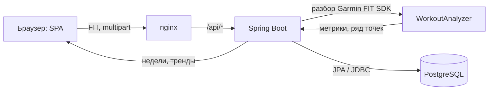
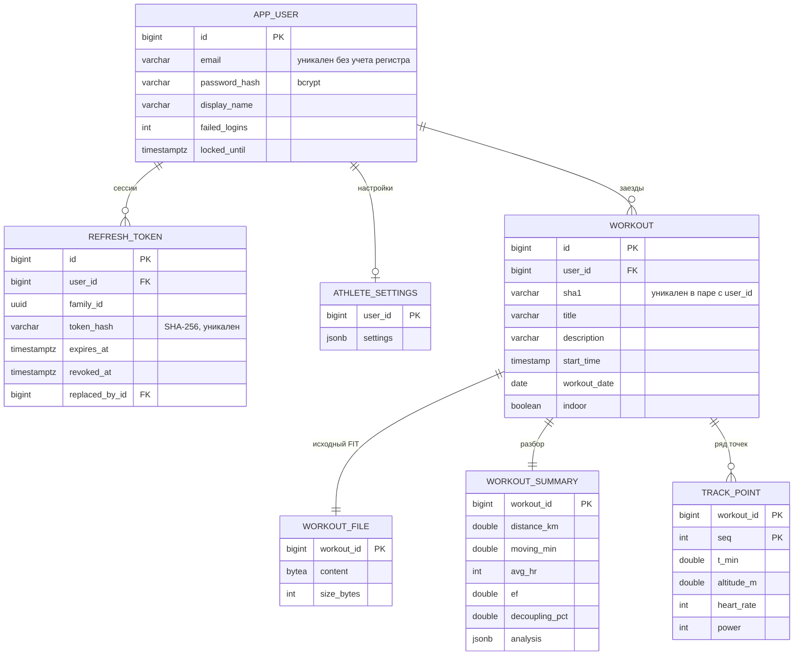

# Отчет: приложение LOPON по методологии 12 факторов

Домашнее задание по курсу SRE: взять клиент-серверное приложение и привести его к cloud-native виду по методологии
[The Twelve-Factor App](https://12factor.net). Исходное приложение это мой личный проект LOPON для разбора
велотренировок. Оно было написано на Python (FastAPI, SQLite и одна HTML-страница). Для задания оно переписано на
Java 25 и Spring Boot 4.1, данные теперь хранятся в PostgreSQL, а фронтенд стал отдельным приложением. Код лежит в
одном репозитории: `backend/` (Maven), `frontend/` (npm), в корне `docker-compose.yml`.

## 1. Доменная область

Приложение анализирует велотренировки по FIT-файлам с велокомпьютера Magene. Велокомпьютер записывает каждую поездку
в бинарный файл формата FIT по протоколу Garmin. Раз в секунду туда пишутся пульс, скорость, каденс, мощность, высота, температура и координаты GPS, а в конце лежит итоговая сессия: вид спорта, дистанция, FTP из
профиля. Сам по себе такой файл мало что говорит. Чтобы понять, растет ли аэробная база и нет ли перегрузки, нужно
разбирать все заезды по одинаковым правилам, хранить историю и смотреть недельные сводки и тренды.

Как проходят данные:



1. Загрузка. Пользователь перетаскивает один или несколько файлов `.fit`.
2. Разбор. Garmin FIT SDK достает из файла записи `record`, сессию и `file_id`.
3. Анализ. Функция `WorkoutAnalyzer.analyze(fit, settings, filename)` считает по настройкам спортсмена:
   - время в движении, зоны пульса от HRmax, узкую "полку Z2" и нагрузку (минуты в зоне умножаются на коэффициент
     зоны)
   - EF, то есть скорость на один удар пульса
   - аэробный дрейф. На улице он считается только по самому длинному ровному участку, на станке по половинам заезда
     (мощность/пульс). Если тренировка интервальная, дрейф помечается как непоказательный
   - эффорты (участки высокого пульса), каденс с порогами 80 и 90 об/мин, набор высоты по сглаженной высоте,
     температуру
   - по мощности: NP, IF, TSS, зоны Коггана и рабочие ERG-блоки на станке с оценкой стабильности (CV)
   - предупреждения. Например, пик пульса на скорости больше 45 км/ч похож на артефакт ремня. В этом случае
     выводится предупреждение, а сами данные не меняются
4. Хранение. В PostgreSQL сохраняются метаданные тренировки, исходный FIT, сводка с метриками, полный разбор в jsonb
   и прореженный ряд точек для графиков и трека.
5. Просмотр. Список заездов, разбор с графиками, недели (с понедельника по воскресенье), тренды EF и дрейфа,
   прогресс к цели в Вт/кг. Название и описание заезда можно редактировать. В описание удобно записывать контекст,
   например "недосып, кофе". Такие вещи поднимают пульс, и их нужно учитывать при интерпретации, а не исправлять
   данные.
6. Пересчет. Если поменять настройки (HRmax, FTP, пороги), все заезды пересчитываются из исходных FIT-файлов.

Пользователи. Есть регистрация и вход, API работает с Bearer-токенами. У каждого пользователя свои заезды и
настройки. На запрос чужого ресурса API отвечает 404, как будто его нет.

## 2. Стек

| Слой | Технологии | Зачем |
|---|---|---|
| Язык и рантайм | Java 25 (LTS), Eclipse Temurin | Текущая LTS-версия, виртуальные потоки для ввода-вывода |
| Фреймворк | Spring Boot 4.1.1: Web MVC (встроенный Tomcat 11), Data JPA (Hibernate 7.4), Validation | REST API, ORM, валидация запросов и настроек |
| Безопасность | Spring Security 7: OAuth2 Resource Server (JWT HS256), BCrypt | Аутентификация без серверных сессий по заголовку `Authorization: Bearer` |
| БД | PostgreSQL 17 | Единственное место, где хранится состояние, в том числе исходные файлы (`bytea`) и разбор (`jsonb`) |
| Миграции | Flyway 12 (`db/migration/V1__init.sql`) | Схема версионируется, `ddl-auto: validate` сверяет сущности со схемой |
| Разбор FIT | Garmin FIT SDK `com.garmin:fit:21.217.0` | Официальная Java-библиотека для формата FIT |
| Наблюдаемость | Actuator, Micrometer Prometheus, структурные логи ECS | Пробы liveness и readiness, `/actuator/prometheus`, JSON-логи в stdout |
| Документация API | springdoc-openapi 3 (Swagger UI) | `/api/docs`, `/api/openapi.json`, кнопка Authorize для Bearer-токена |
| Сборка | Maven Wrapper (Maven 3.9.11), `spring-boot-maven-plugin` (`build-info`, слоеный jar) | Воспроизводимая сборка, Maven ставить не нужно |
| Фронтенд | HTML, CSS, JavaScript (ES-модули, без фреймворка), Vite 8, Chart.js 4.5, шрифт Montserrat из npm | Легкая SPA, все зависимости в `package.json`, CDN не используется |
| Веб-сервер фронтенда | nginx (`nginx-unprivileged`, шаблоны через envsubst) | Отдает статику, проксирует `/api/`, CSP, ограничение частоты запросов на вход |
| Контейнеры | Docker (multistage), Docker Compose | Сборка, релиз и запуск, паритет окружений |
| Тесты | JUnit 5, AssertJ, MockMvcTester, Testcontainers (PostgreSQL 17) | 20 golden-тестов разбора и 14 интеграционных тестов API на настоящем Postgres |

## 3. Основные сущности

### 3.1. ER-диаграмма



### 3.2. Сущности и поля

#### AppUser (`app_user`)

Учетная запись пользователя.

| Поле                            | Тип              | Смысл                                                                                     |
|---------------------------------|------------------|-------------------------------------------------------------------------------------------|
| `id`                            | bigint identity  | Идентификатор, попадает в `sub` JWT                                                       |
| `email`                         | varchar(254)     | Логин, перед сохранением нормализуется (trim, lower), уникальный индекс по `lower(email)` |
| `password_hash`                 | varchar(100)     | Хеш вида `{bcrypt}...` (DelegatingPasswordEncoder), сам пароль не хранится                |
| `display_name`                  | varchar(100)     | Имя в интерфейсе                                                                          |
| `failed_logins`, `locked_until` | int, timestamptz | Счетчик неудачных входов и время блокировки для защиты от брутфорса                       |
| `created_at`, `updated_at`      | timestamptz      | Аудит                                                                                     |

#### RefreshToken (`refresh_token`)

Долгоживущая сессия, через которую обновляется access-токен.

| Поле                       | Тип         | Смысл                                                                               |
|----------------------------|-------------|-------------------------------------------------------------------------------------|
| `token_hash`               | varchar(64) | SHA-256 от случайных 256 бит. Сам токен хранится только в HttpOnly-cookie у клиента |
| `family_id`                | uuid        | Цепочка ротаций одного входа                                                        |
| `expires_at`, `revoked_at` | timestamptz | Срок действия (`JWT_REFRESH_TTL`, 30 дней) и отзыв (ротация, выход, смена пароля)   |
| `replaced_by_id`           | bigint      | Какой токен пришел на смену при ротации                                             |

#### AthleteSettings (`athlete_settings`)

Пороги разбора, одна строка на пользователя. В поле `settings` (jsonb) лежат HRmax, режим и границы зон, "полка
Z2", FTP и откуда его брать (из настроек или из поля `threshold_power` в файле), параметры ровного участка и дрейфа,
ERG-блоков, температурные пороги и смещение часового пояса. Значения по умолчанию задаются в
`AnalysisSettings.DEFAULTS`. При сохранении тело запроса сливается с ними и проверяется через Bean Validation.
Например, у зон должно быть четыре возрастающие границы, а вес должен быть больше нуля.

#### Workout (`workout`)

Тренировка, основной CRUD-ресурс.

| Поле | Тип | Смысл |
|---|---|---|
| `user_id` | bigint | Владелец, все запросы фильтруются по нему |
| `sha1` | varchar(40) | Хеш файла. `unique(user_id, sha1)` не дает сохранить дубль, даже если две загрузки идут одновременно |
| `filename` | varchar(255) | Исходное имя файла |
| `title`, `description` | varchar | Название и описание, которые задает пользователь, меняются через `PATCH` |
| `start_time`, `workout_date` | timestamp, date | Локальное время начала. Magene пишет в FIT местное время, смещение задается в настройках |
| `sport`, `sub_sport`, `indoor` | varchar, boolean | Вид активности. Станок определяется по отсутствию GPS или по `indoor`/`virtual` в sub_sport |
| `has_gps`, `has_power`, `has_hr`, `device` | boolean, varchar | Какие датчики были и производитель устройства из `file_id` |

#### WorkoutFile (`workout_file`)

Исходный FIT в поле `bytea`. Он нужен, чтобы пересчитать разбор при смене настроек и чтобы файл можно было скачать
обратно (`GET /api/workouts/{id}/file`). Файл вынесен в отдельную таблицу, чтобы запросы списка и разбора не тянули
лишние мегабайты.

#### WorkoutSummary (`workout_summary`)

Результат анализа. Часть данных лежит в обычных колонках, чтобы список, недели и тренды работали без разбора JSON:

- дистанция, время в движении и время остановок, средняя и максимальная скорость
- пульс, каденс, набор и спуск, температура, ккал, нагрузка
- EF, дрейф (процент, метод, достоверность), доля "полки Z2" и доля времени в зонах до Z2 включительно
- средняя мощность, NP, IF, TSS, использованный FTP, число предупреждений

Остальное лежит в колонке `analysis` (jsonb) в виде полного вложенного разбора: зоны пульса и мощности, эффорты,
ERG-блоки, дрейф с половинами и вердиктом, рельеф по половинам, предупреждения и настройки, с которыми считался
разбор.

#### TrackPoint (`track_point`)

Прореженный ряд точек для графиков и трека, первичный ключ `(workout_id, seq)`. Точек не больше, чем
`series_max_points` (по умолчанию 1500). Поля: минута от старта, километр, широта и долгота, сглаженная высота,
пульс, каденс, мощность, сглаженная скорость, температура. При пересчете ряд полностью пересоздается: старые точки
удаляются, а новые вставляются JDBC-батчем в той же транзакции.

### 3.3. Вложенные объекты разбора (`analysis jsonb`)

`HrZones` (границы и минуты по зонам Z1-Z5, полка Z2), `Decoupling` (метод `flat_segment`, `whole_ride_power`,
`whole_ride_speed` или `none`, половины, процент, вердикт, `reliable`), `Effort`, `Power` (`np`, `if`, `tss`, зоны
Коггана, `ErgBlock`), `HalvesAltitude`, `warnings`. Их структура совпадает с JSON из Python-версии, ключи в
snake_case.

## 4. Соответствие 12 факторам

### 4.1. Сводная таблица

| №  | Фактор              | Как сделано                                                                                                                                                                                | Где смотреть                                                                                | Как проверить                                                                                   |
|----|---------------------|--------------------------------------------------------------------------------------------------------------------------------------------------------------------------------------------|---------------------------------------------------------------------------------------------|-------------------------------------------------------------------------------------------------|
| 1  | Codebase            | Один git-репозиторий, в нем бэкенд, фронтенд, инфраструктура и CI. Все окружения собираются из него                                                                                        | корень репозитория                                                                          | `git log`, CI запускается на каждый push                                                        |
| 2  | Dependencies        | Все зависимости объявлены явно и с фиксированными версиями: `pom.xml` (BOM Spring Boot 4.1.1), Maven Wrapper, `package.json` и `package-lock.json`. CDN и системные пакеты не используются | `backend/pom.xml`, `backend/.mvn/wrapper`, `frontend/package*.json`                         | `./mvnw verify` и `npm ci` на чистой машине                                                     |
| 3  | Config              | Все, что отличается между окружениями, задается переменными окружения. Секретов в репозитории нет, профилей под окружения нет                                                              | `backend/src/main/resources/application.yml`, `.env.example`, `docker-compose.yml`          | Без `DB_URL` или `JWT_SECRET` приложение не запускается                                         |
| 4  | Backing services    | PostgreSQL подключается по `DB_URL`, чтобы сменить базу, достаточно поменять URL                                                                                                           | `application.yml`, `docker-compose.yml`                                                     | Указать другой `DB_URL` (managed PG, кластер)                                                   |
| 5  | Build, release, run | Multistage-сборка, затем неизменяемый образ с версией (git SHA), затем запуск с конфигурацией из окружения. Миграции выполняются отдельным шагом релиза                                    | `backend/Dockerfile`, `frontend/Dockerfile`, `.github/workflows/ci.yml`                     | `/actuator/info` показывает `app.version`                                                       |
| 6  | Processes           | Процессы не хранят состояние: файлы, сессии, блокировки входа и refresh-токены лежат в PostgreSQL, локальный диск не используется                                                          | `WorkoutFile`, `RefreshToken`, `AppUser.locked_until`                                       | После перезапуска или удаления контейнера данные на месте, сессии пользователей не сбрасываются |
| 7  | Port binding        | Исполняемый jar со встроенным Tomcat слушает `${PORT}`, метрики и пробы на `${MANAGEMENT_PORT}`, nginx слушает свой `${PORT}`                                                              | `application.yml`, `nginx/default.conf.template`                                            | `PORT=9090 java -jar ...`                                                                       |
| 8  | Concurrency         | Масштабирование процессами (`--scale backend=3`). Типы процессов: web, migrate, reanalyze, purge.                                                                                          | `docker-compose.yml`, `LoponApplication`                                                    | Запросы расходятся по экземплярам, один JWT подходит для всех                                   |
| 9  | Disposability       | Старт за несколько секунд, graceful shutdown по SIGTERM, java работает как PID 1, загрузка идет в транзакции и ее можно безопасно повторить                                                | `application.yml` (`server.shutdown`), `Dockerfile` (exec-форма)                            | `docker compose stop backend`, в логе "Graceful shutdown complete"                              |
| 10 | Dev/prod parity     | Один и тот же Postgres 17 в compose, в тестах (Testcontainers) и на проде, одинаковые образы и способ конфигурации                                                                         | `docker-compose.yml`, `IntegrationTest`                                                     | `./mvnw verify` работает с настоящим Postgres, а не с H2                                        |
| 11 | Logs                | Логи пишутся только в stdout в виде JSON (ECS) с `request_id` и `user_id`. nginx тоже пишет access log в JSON. Файлов с логами нет                                                         | `application.yml` (`logging.structured`), `LoggingContextFilter`, `log_format json` в nginx | `docker compose logs backend`                                                                   |
| 12 | Admin processes     | Миграции и обслуживание запускаются как одноразовые процессы из того же образа и с той же конфигурацией: `migrate`, `reanalyze`, `purge-expired-tokens`                                    | `LoponApplication.runAdmin`, `AdminCommandRunner`, сервис `migrate` в compose               | `docker compose run --rm backend reanalyze`                                                     |

## 5. Запуск и проверка

```bash
# в .env вписать DB_PASSWORD (любой пароль) и JWT_SECRET (вывод openssl rand -base64 32)
docker compose up --build -d         
```
http://localhost:8000/api/docs - здесь будет доступен Swagger UI, кнопка Authorize для Bearer-токена
http://localhost:8000 - тут будет доступна регистрация и приложение, как для конечного пользователя

### REST API

| Метод и путь                                               | Назначение                                                                                                                                    |
|------------------------------------------------------------|-----------------------------------------------------------------------------------------------------------------------------------------------|
| `POST /api/auth/register`, `/login`                        | Регистрация и вход. Ответ `{access_token, token_type: "Bearer", expires_in, user}`, refresh-токен приходит в HttpOnly-cookie                  |
| `POST /api/auth/refresh`, `/logout`                        | Ротация refresh-токена и выход                                                                                                                |
| `GET`, `DELETE /api/auth/me`, `POST /api/auth/password`    | Профиль, удаление аккаунта, смена пароля                                                                                                      |
| `POST /api/workouts`                                       | Загрузка FIT (multipart, поле `file`). Ответы: 201 и заголовок `Location`, 409 если дубль, 422 если это не FIT, 413 если файл слишком большой |
| `GET /api/workouts?page&size`                              | Список своих заездов                                                                                                                          |
| `GET`, `PATCH`, `DELETE /api/workouts/{id}`                | Детали, изменение названия и описания, удаление                                                                                               |
| `GET /api/workouts/{id}/summary`, `/track-points`, `/file` | Метрики, ряд точек, исходный файл                                                                                                             |
| `POST /api/workouts/reanalyze`                             | Пересчет своих заездов                                                                                                                        |
| `GET`, `PUT /api/settings`                                 | Настройки разбора (с валидацией)                                                                                                              |
| `GET /api/stats/weeks`, `/api/stats/trends`                | Недели и тренды                                                                                                                               |
